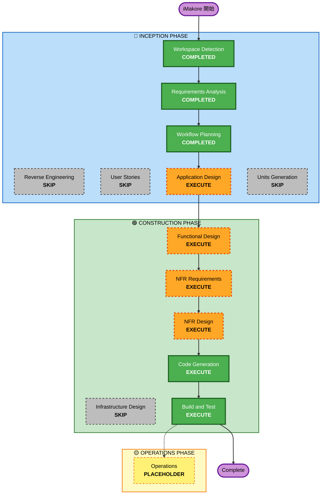

# iMakore (イマコレ) — 実行計画 (Execution Plan)

## 1. 詳細分析サマリー

### 変更影響評価

| 影響領域 | 有無 | 内容 |
|---|---|---|
| ユーザー向け変更 | あり | 新規 Web アプリ全体。ボタン操作・タイマー表示・カレンダーが主要 UI |
| 構造的変更 | N/A | 新規グリーンフィールド（既存コードなし）|
| データモデル変更 | あり | プロジェクト・セッション・日次記録の新規データモデルが必要 |
| API 変更 | なし | 外部 API 不使用。ブラウザ localStorage のみ |
| NFR 影響 | あり | リアルタイムタイマー（毎秒更新）、localStorage 容量管理、オフライン動作 |

### リスク評価

| 項目 | 評価 |
|---|---|
| **リスクレベル** | Low |
| **ロールバック複雑度** | 容易（静的ファイルを差し替えるだけ）|
| **テスト複雑度** | 中程度（タイマーロジック・日付計算に境界値テストが必要）|

**理由**: バックエンドなし、外部依存なし、GitHub Pages への静的配信のみ。最大の技術リスクはタイマーの精度管理（スリープ復帰後の時刻補正）と localStorage のデータスキーマ設計。

---

## 2. ワークフロー可視化

**凡例:**
- 緑 (COMPLETED): 完了済み
- オレンジ破線 (EXECUTE): 実行予定
- グレー破線 (SKIP): スキップ
- 黄 (PLACEHOLDER): 将来対応

---

## 3. 実行フェーズ一覧

### 🔵 INCEPTION PHASE

| ステージ | 判定 | 根拠 |
|---|---|---|
| Workspace Detection | COMPLETED | グリーンフィールド検出、新規ディレクトリ作成済み |
| Reverse Engineering | SKIP | グリーンフィールド（既存コードなし）|
| Requirements Analysis | COMPLETED | 機能・非機能要件 15 件定義済み |
| User Stories | SKIP | 単一ユーザーの自己管理ツール。要件が十分明確で受け入れ基準への分解不要 |
| Workflow Planning | COMPLETED（本文書）| — |
| **Application Design** | **EXECUTE** | 新規アプリにつき TimerService / StorageService / CalendarView 等のコンポーネント構造とサービス層の設計が必要 |
| Units Generation | SKIP | 単一配信単位（静的 Web アプリ）。複数ユニットへの分解は不要 |

### 🟢 CONSTRUCTION PHASE（単一ユニット: U1-core）

| ステージ | 判定 | 根拠 |
|---|---|---|
| **Functional Design** | **EXECUTE** | 新規データモデル（Project / Session / DailyRecord）とタイマーロジック・日次リセット等のビジネスルールの詳細設計が必要 |
| **NFR Requirements** | **EXECUTE** | タイマー精度（毎秒更新・スリープ復帰補正）、localStorage 容量管理、モバイルタッチ操作の要件決定が必要 |
| **NFR Design** | **EXECUTE** | NFR Requirements を実行するため。タイマー実装パターン（`Date.now()` ベース差分計算）と localStorage スキーマ設計が必要 |
| Infrastructure Design | SKIP | クラウドインフラなし。GitHub Pages は静的ファイル配信のみで設計不要 |
| **Code Generation** | **EXECUTE** | 常時実行 |
| **Build and Test** | **EXECUTE** | 常時実行 |

### 🟡 OPERATIONS PHASE

| ステージ | 判定 | 根拠 |
|---|---|---|
| Operations | PLACEHOLDER | 将来対応（現時点では GitHub Pages へのデプロイ手順のみ） |

---

## 4. 想定タイムライン

| ステージ | 想定工数（AI wall-clock）|
|---|---|
| Application Design | 30〜45 分 |
| Functional Design | 45〜60 分 |
| NFR Requirements | 20〜30 分 |
| NFR Design | 20〜30 分 |
| Code Generation | 60〜90 分 |
| Build and Test | 20〜30 分 |
| **合計** | **約 3〜4.5 時間** |

---

## 5. 成功基準

- **Primary Goal**: ブラウザ上で動作する iMakore アプリが GitHub Pages に公開されること
- **Key Deliverables**:
  - バニラ HTML/CSS/JS による静的 Web アプリ一式
  - localStorage によるオフライン永続化
  - リアルタイムタイマー表示
  - 内蔵月カレンダービュー
  - プロジェクト登録・削除機能
- **Quality Gates**:
  - タイマーがスリープ復帰後も正確に動作すること
  - 0 時をまたいだ際に日次リセットが正常に機能すること
  - localStorage へのデータ読み書きが正しく動作すること
  - モバイルブラウザで快適に操作できること
